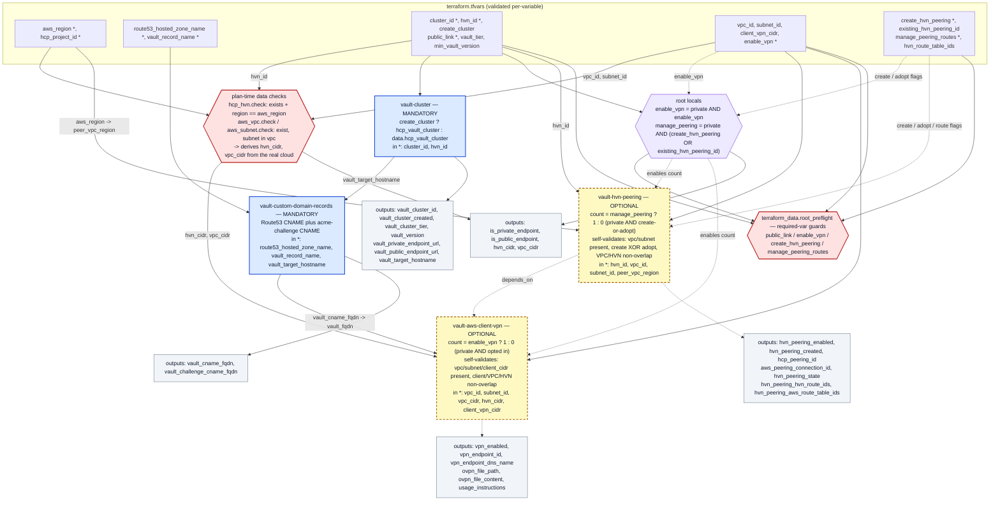

# Optional reading

[← Back to README](../README.md)

Background on how the pieces fit together. Not needed to run the configuration.

## Module wiring diagram

Which modules always run, which are conditional, and which output of one feeds
the input of the next.

### Legend

| Element | Meaning |
|---|---|
| Blue node | A module that always runs |
| Yellow dashed node | A module that runs only when its condition is met |
| Purple hexagon | Not a module — a `main.tf` local. `GATE` derives `enable_vpn` and `manage_peering` from `public_link` and the opt-ins. |
| Red hexagon | Validation. `CHK` reads the HVN, VPC, and subnet at plan time and derives their CIDRs; `PRE` is the required-variable guards. Either one aborts the plan on failure. |
| Grey node | A group of `outputs.tf` values |
| Solid arrow | Wiring always in effect |
| Dashed arrow | Conditional wiring — a `count` toggle, `depends_on` ordering, or an override |
| `*` on an input | Must be set; the default fails validation |

Key points:

- `CHK` and `PRE` run during `plan`, and `apply` plans first, so an invalid
  input set never reaches resource creation.
- `hvn_cidr` and `vpc_cidr` are read from the cloud, not entered.
- `create_cluster = false`, and `create_hvn_peering = false` with
  `existing_hvn_peering_id` set, make `vault-cluster` and `vault-hvn-peering`
  read existing resources rather than create them.
- `GATE -.-> MP` / `GATE -.-> MV` is the `count` decision, not a value.
  `MP -.-> MV` is apply ordering, not data flow.
- With `manage_peering_routes = true`, `vault-hvn-peering` reads the HVN's
  existing routes from the HCP API at plan time (`data.http.hvn_routes`) and the
  target route tables from AWS. The API host and bearer token come from
  `HCP_API_ADDRESS` / `HCP_API_TOKEN`, which the root reads from the environment
  and passes in; the organization is `hcp_organization_id`. A route direction
  that already exists and points at this peering is adopted through a root
  `import` block instead of failing on a duplicate; one that points elsewhere
  fails the plan. A brand-new peering (`create_hvn_peering = true`) has nothing
  to adopt, so both directions are created.

The full input-to-outcome matrix is in
[Networking enablement](Inputs.md#networking-enablement).
