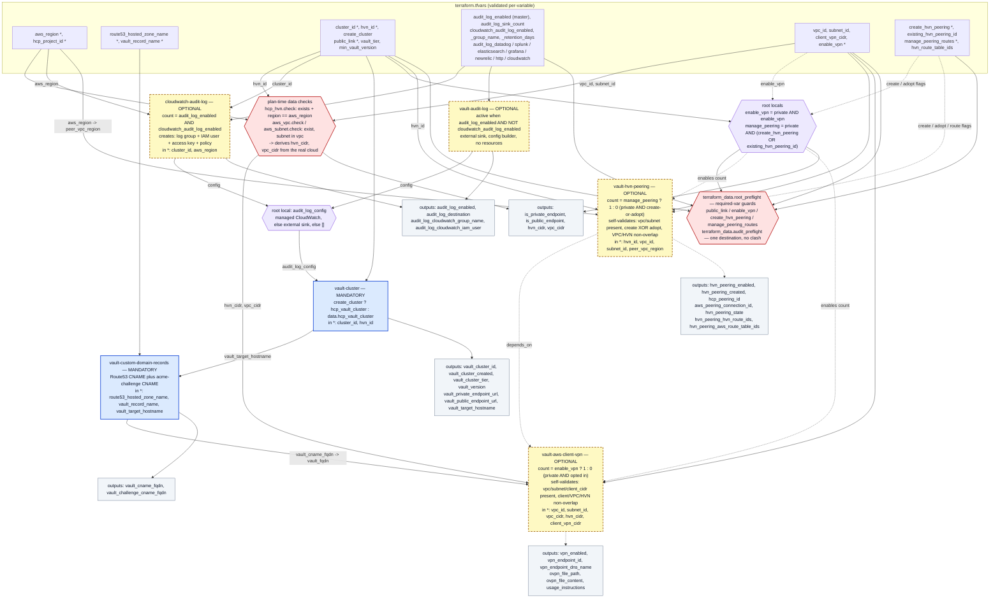

# Optional reading

[← Back to README](../README.md)

## Module wiring diagram

Which modules are always created, which are `count`-gated, and which output of one
module feeds which input of the next. See the legend below the diagram.

### Diagram legend

| Element                                                                                                        | Meaning                                                                                                                                                                                                                                                                                                                                                                                                              |
|----------------------------------------------------------------------------------------------------------------|----------------------------------------------------------------------------------------------------------------------------------------------------------------------------------------------------------------------------------------------------------------------------------------------------------------------------------------------------------------------------------------------------------------------|
| 🟦 Blue node (`vault-cluster`, `vault-custom-domain-records`)                                                  | **Mandatory module** — always instantiated, no `count`                                                                                                                                                                                                                                                                                                                                                               |
| 🟨 Yellow dashed node (`cloudwatch-audit-log`, `vault-audit-log`, `vault-hvn-peering`, `vault-aws-client-vpn`) | **Optional module** — `count`-gated, or a no-op when its toggle is `false`                                                                                                                                                                                                                                                                                                                                           |
| 🟪 Purple hexagon (`GATE`, `AMERGE`)                                                                           | Not a module — `root main.tf` locals: `GATE` derives `enable_vpn` and `manage_peering` from `public_link` plus the per-concern opt-ins; `AMERGE` = picks which audit module's `config` reaches the cluster                                                                                                                                                                                                           |
| 🟥 Red hexagon (`CHK`, `PRE`)                                                                                  | Validation. `CHK` = plan-time data-source reads (HVN / VPC / subnet exist and agree) that also **derive** `hvn_cidr` / `vpc_cidr` from the cloud; `PRE` = `terraform_data.root_preflight` (required-var guards) + `terraform_data.audit_preflight` (one audit destination, no clash). Presence and CIDR-overlap checks for the VPN and peering modules live **inside** those modules. Any aborts the plan on failure |
| ⬜ Grey node (`OC`, `OA`, …)                                                                                    | A group of root `outputs.tf` values                                                                                                                                                                                                                                                                                                                                                                                  |
| `terraform.tfvars` box                                                                                         | Root input variables, grouped by concern; one box can feed several modules                                                                                                                                                                                                                                                                                                                                           |
| **Solid arrow** `-->`                                                                                          | Wiring that is always in effect                                                                                                                                                                                                                                                                                                                                                                                      |
| **Dashed arrow** `-.->`                                                                                        | Conditional wiring — `count` enablement, `depends_on` ordering, or an override variable that only matters in some cases                                                                                                                                                                                                                                                                                              |
| **Arrow label** `a to b`                                                                                       | The producing `output` (`a`) and the consuming `input` (`b`) it is assigned to; a bare label names the single value passed                                                                                                                                                                                                                                                                                           |
| `*` after an input name                                                                                        | Mandatory input — must be set (it defaults to `""`, which fails validation)                                                                                                                                                                                                                                                                                                                                          |
| `in *:` inside a module node                                                                                   | That module's mandatory inputs; other inputs listed on the node are optional                                                                                                                                                                                                                                                                                                                                         |

Notes:

- **Nothing downstream runs if `CHK` or `PRE` fail** — both are evaluated during
  `plan`, and `terraform apply` runs a plan first, so an invalid input set never
  reaches resource creation. See [Inputs](Inputs.md) and the full input →
  outcome matrix in [Networking enablement](Inputs.md#networking-enablement).
- `hvn_cidr` and `vpc_cidr` are **not inputs** — `CHK` reads them from the real
  HVN and VPC. That is why `IN_N` does not list them.
- Every string variable defaults to `""`; the `*`-marked string ones ship in
  `terraform.tfvars` as `REPLACE_WITH_*` placeholders and fail per-variable
  validation until set.
- `public_link`, `enable_vpn`, `create_hvn_peering`, `manage_peering_routes`
  have **no default** (`*`). `terraform_data.root_preflight` fails the plan,
  naming the variable, until each one that applies is set: `public_link` always;
  `enable_vpn` / `create_hvn_peering` when `public_link = false`;
  `manage_peering_routes` once a peering is created or adopted. A public cluster
  needs none of the last three.
- `create_cluster` defaults to `false` — `MC` reads `data.hcp_vault_cluster`.
  `MP` reads `data.hcp_aws_network_peering` when `create_hvn_peering = false` and
  `existing_hvn_peering_id` is set (a peering established outside this config).
- Audit modules: `audit_log_enabled` is the master switch. When on,
  `cloudwatch_audit_log_enabled` routes to `cloudwatch-audit-log` (which
  `count`-creates the log group + IAM), otherwise to `vault-audit-log` (exactly
  one `audit_log_<vendor>` object). `AMERGE` picks the active path's `config`.
- The `GATE -.-> MP` / `GATE -.-> MV` edges are the `count = … ? 1 : 0` decision,
  not a value assignment.
- `MP -.-> MV` is a `depends_on` (apply ordering), not data flow.
- Colours are set with mermaid `classDef`; exact rendering depends on the
  viewer's mermaid theme, but the solid-vs-dashed distinction always holds.

### Wiring, in text

| Module | Mandatory? | Mandatory inputs | Optional inputs | Fed by | Feeds |
|---|---|---|---|---|---|
| `vault-cluster` | **yes** | `cluster_id`, `hvn_id` | `create_cluster`, `public_link`, `vault_tier`, `min_vault_version`, `audit_log_config` | `local.audit_log_config` (from `cloudwatch-audit-log` / `vault-audit-log`) | `vault-custom-domain-records`, root outputs |
| `cloudwatch-audit-log` | no (`count` on `audit_log_enabled && cloudwatch_audit_log_enabled`) | `cluster_id`, `aws_region` | `log_group_name`, `retention_in_days`, `tags` | tfvars only | `local.audit_log_config` → `vault-cluster`, root outputs |
| `vault-audit-log` | no (active on `audit_log_enabled && !cloudwatch_audit_log_enabled`) | — | one of `cloudwatch`/`datadog`/`elasticsearch`/`grafana`/`splunk`/`newrelic`/`http` | tfvars only | `local.audit_log_config` → `vault-cluster` |
| `vault-custom-domain-records` | **yes** | `route53_hosted_zone_name`, `vault_record_name`, `vault_target_hostname` | — | `vault-cluster.vault_target_hostname` | `vault-aws-client-vpn.vault_fqdn`, root outputs |
| `vault-hvn-peering` | no (`count = manage_peering`: private ∧ create-or-adopt) | `hvn_id`, `vpc_id`, `subnet_id`, `peer_vpc_region` | `route_table_ids`, `create_peering`, `existing_peering_id`, `manage_routes` | tfvars + `GATE` | `depends_on` for `vault-aws-client-vpn`, root outputs |
| `vault-aws-client-vpn` | no (`count = enable_vpn`: private ∧ opted in) | `vpc_id`, `subnet_id`, `vpc_cidr`, `hvn_cidr`, `client_vpn_cidr` | `vault_fqdn`, `ovpn_output_path` | `vault-custom-domain-records`, `CHK` (`vpc_cidr` / `hvn_cidr`), `GATE` | root outputs (`.ovpn` profile) |

## Audit logging configuration

### How the switches work

Two booleans in `terraform.tfvars`:

|          `audit_log_enabled`           | `cloudwatch_audit_log_enabled` |    `audit_log_<vendor>` objects    | Result                                                                                                          |
|:--------------------------------------:|:------------------------------:|:----------------------------------:|-----------------------------------------------------------------------------------------------------------------|
|                `false`                 |            *(any)*             |              *(any)*               | **No audit logging.** No `audit_log_config` on the cluster. Everything else ignored                             |
|                 `true`                 |             `true`             |                none                | **Terraform-managed CloudWatch.** `cloudwatch-audit-log` creates the log group + IAM user/key and streams to it |
|                 `true`                 |             `true`             |                 ≥1                 | **Plan fails** — that path manages its own destination, remove the vendor object(s)                             |
|                 `true`                 |            `false`             | exactly `audit_log_sink_count` (1) | **External sink.** `vault-audit-log` forwards your credentials to that pre-existing destination                 |
|                 `true`                 |            `false`             |              0 or ≥2               | **Plan fails** — audit is on but the destination is missing or ambiguous                                        |
|                `false`                 |             `true`             |              *(any)*               | **Plan fails** — `cloudwatch_audit_log_enabled` needs `audit_log_enabled = true`                                |
| *(any)* while `create_cluster = false` |               —                |           any object set           | **Plan fails** — audit config can't be pushed to an adopted cluster                                             |

`audit_log_enabled` is the master switch — nothing about audit logging happens
unless it is `true`. `cloudwatch_audit_log_enabled` then chooses *how* the
destination is provided: managed by this config, or supplied by you.

### What was built

- Module **`cloudwatch-audit-log`** — *creates* the AWS-native destination.
  Every resource is `count`-gated on `local.audit_manage_cloudwatch`
  (`audit_log_enabled && cloudwatch_audit_log_enabled`):
  - `aws_cloudwatch_log_group` — `"/hcp/vault/<cluster_id>/audit"` by default
    (`cloudwatch_audit_log_group_name` overrides), `retention_in_days` from
    `cloudwatch_audit_log_retention_days` (default 30).
  - `aws_iam_user` + `aws_iam_access_key` — a dedicated principal for HCP.
  - `aws_iam_user_policy` — least privilege: `logs:CreateLogStream`,
    `logs:PutLogEvents`, `logs:DescribeLogStreams` on that log group's ARN, plus
    `logs:DescribeLogGroups` (not resource-scopable).
  - Output `config` — the `audit_log_config` payload (region, group name,
    generated key pair) or `[]`.
- Module **`vault-audit-log`** — no resources; packages the credentials you
  supply for a sink that already exists. Enabled only when
  `local.audit_use_external_sink` (`audit_log_enabled && !cloudwatch_audit_log_enabled`).
  All seven objects (`audit_log_cloudwatch`, `_datadog`, `_elasticsearch`,
  `_grafana`, `_splunk`, `_newrelic`, `_http`) stay available and commented in
  `terraform.tfvars`.
- Root `main.tf`:
  - `local.audit_log_config = local.audit_manage_cloudwatch ? module.cloudwatch_audit_log.config : module.vault_audit_log.config`
  - `resource "terraform_data" "audit_preflight"` carries the two cross-module
    audit `precondition`s — destination resolvable (`== audit_log_sink_count`)
    and no CloudWatch/vendor clash.
  - `cloudwatch_audit_log_enabled ⇒ audit_log_enabled` is enforced inside
    `cloudwatch-audit-log` (a `precondition` on its `config` output);
    `audit_log_enabled ⇒ create_cluster` inside `vault-cluster` (a `precondition`
    on the adopt-path data source).
  - `vault-audit-log` still carries its own `precondition` (exactly one vendor
    object when it is the active path).
- `vault-cluster` renders `dynamic "audit_log_config"` reading all 30 provider
  attributes through `try(..., null)`, so either module can pass a sparse map.

### Why this shape

- **Why CloudWatch for the managed path.** `hcp_vault_cluster.audit_log_config`
  supports seven sinks, but six of them (Datadog, Splunk, Elasticsearch,
  Grafana, New Relic, generic HTTP) live outside AWS and need an account plus an
  API token that Terraform can't create. CloudWatch is the only one this config
  can stand up **end-to-end** with the `aws` provider it already loads and the
  region it already has — a log group and an IAM user are both Terraform-native.
  That makes it the right choice for the "Terraform manages it" path.
- **Why a static IAM key.** The `audit_log_config` schema exposes only
  `cloudwatch_access_key_id` / `cloudwatch_secret_access_key` for CloudWatch —
  there is no role-ARN field — so HCP must be handed a long-lived key. The
  module contains the blast radius: its own user, its own inline policy, write
  access to one log group.
- **Why keep `vault-audit-log`.** Teams that already centralise logs in a SIEM
  shouldn't be forced onto CloudWatch. Leaving the seven sinks wired (just
  toggled off) means switching is a `terraform.tfvars` edit, not a code change.
- **Why a builder module with no resources.** There is no standalone
  `hcp_vault_audit_log` resource — audit config is a `max_items = 1` block
  *inside* `hcp_vault_cluster`. Neither audit module can own it directly; they
  can only produce the block body, which `vault-cluster` splices in.
- **Why two switches instead of one.** `audit_log_enabled` answers "is audit
  logging on?" independently of how the destination is provided.
  `cloudwatch_audit_log_enabled` answers "does Terraform own the destination, or
  do I point at an existing one?". A missing/ambiguous destination, or
  `cloudwatch_audit_log_enabled` without the master switch, is a hard error — not
  a silent fallback — because audit logging that silently doesn't happen is a
  compliance risk.
- **Why `audit_log_sink_count`.** The "exactly one external sink" rule is a
  named, defaulted variable (currently pinned to `1` by its own validation)
  rather than a magic number, so the constraint is visible and one edit away
  from widening if HCP ever allows more.

### Turning it on / off

- Turning `audit_log_enabled = true` (with a destination) on an
  **already-created** cluster is an in-place update — `audit_log_config` is not
  `ForceNew`, so the cluster is not rebuilt. Setting it back to `false` removes
  the block; if the CloudWatch path was active its `count`-gated resources (log
  group, IAM user, key) are destroyed too.
- Audit config only applies to a cluster **this config creates**. With
  `create_cluster = false` a data source can't push the block — a `precondition`
  fails the plan if any audit input is set.

### Switching to an external sink

1. `audit_log_enabled = true`, `cloudwatch_audit_log_enabled = false`.
2. Uncomment exactly one `audit_log_<vendor>` block in `terraform.tfvars` and
   fill in real values (zero, two, or a clash with
   `cloudwatch_audit_log_enabled` fails the plan).
3. Keep secrets out of version control — prefer `TF_VAR_audit_log_<vendor>` env
   vars or a git-ignored `*.auto.tfvars`.

| Sink (`audit_log_*`) | Required fields                       | Optional fields                                                                                                                 |
|----------------------|---------------------------------------|---------------------------------------------------------------------------------------------------------------------------------|
| `cloudwatch`         | `region`, `group_name`                | `stream_name`, `access_key_id`, `secret_access_key`                                                                             |
| `datadog`            | `api_key`, `region`                   | —                                                                                                                               |
| `elasticsearch`      | `endpoint`, `user`, `password`        | `dataset`                                                                                                                       |
| `grafana`            | `endpoint`, `user`, `password`        | —                                                                                                                               |
| `splunk`             | `hec_endpoint`, `token`               | —                                                                                                                               |
| `newrelic`           | `account_id`, `license_key`, `region` | —                                                                                                                               |
| `http`               | `uri`                                 | `method`, `codec`, `compression`, `headers`, `basic_user`, `basic_password`, `bearer_token`, `payload_prefix`, `payload_suffix` |

### Security note

The CloudWatch path writes an IAM secret access key into **Terraform state**
(and sends it to HCP). This is intrinsic to HCP's CloudWatch integration.
Mitigations: the key belongs to a dedicated user with a one-log-group policy, and
rotation is `terraform apply
-replace=module.cloudwatch_audit_log.aws_iam_access_key.this[0]`. Protect state
accordingly — with the local backend keep `terraform.tfstate` out of VCS and off
shared disks; HCP Terraform stores it remote and encrypted. The external sinks
carry the same caveat for whatever token you pass them.
