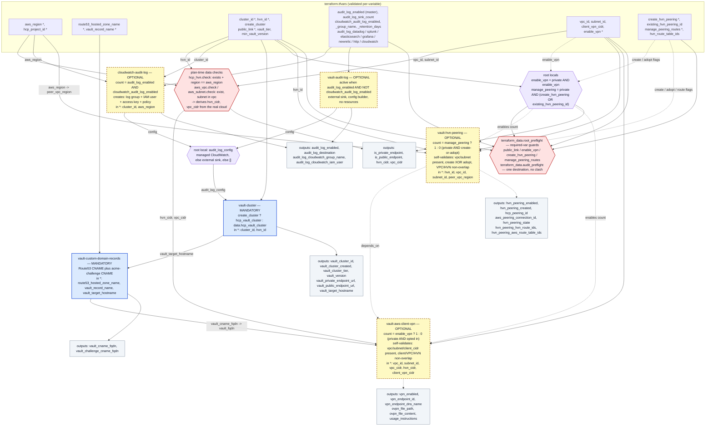

# Optional reading

[← Back to README](../README.md)

Background on how the pieces fit together. Not needed to run the configuration.

## Module wiring diagram

Which modules always run, which are conditional, and which output of one feeds
the input of the next.

### Legend

| Element | Meaning |
|---|---|
| Blue node | A module that always runs |
| Yellow dashed node | A module that runs only when its condition is met |
| Purple hexagon | Not a module — a `main.tf` local. `GATE` derives `enable_vpn` and `manage_peering` from `public_link` and the opt-ins; `AMERGE` picks which audit configuration reaches the cluster. |
| Red hexagon | Validation. `CHK` reads the HVN, VPC, and subnet at plan time and derives their CIDRs; `PRE` is the required-variable and audit-destination guards. Either one aborts the plan on failure. |
| Grey node | A group of `outputs.tf` values |
| Solid arrow | Wiring always in effect |
| Dashed arrow | Conditional wiring — a `count` toggle, `depends_on` ordering, or an override |
| `*` on an input | Must be set; the default fails validation |

Key points:

- `CHK` and `PRE` run during `plan`, and `apply` plans first, so an invalid
  input set never reaches resource creation.
- `hvn_cidr` and `vpc_cidr` are read from the cloud, not entered.
- `create_cluster = false`, and `create_hvn_peering = false` with
  `existing_hvn_peering_id` set, make `vault-cluster` and `vault-hvn-peering`
  read existing resources rather than create them.
- `GATE -.-> MP` / `GATE -.-> MV` is the `count` decision, not a value.
  `MP -.-> MV` is apply ordering, not data flow.

The full input-to-outcome matrix is in
[Networking enablement](Inputs.md#networking-enablement).

## Audit logging configuration

Two switches in `terraform.tfvars`. `audit_log_enabled` turns audit logging on or
off. `cloudwatch_audit_log_enabled` then chooses how the destination is provided:
Terraform creates a CloudWatch group, or you point at a sink that already exists.

| `audit_log_enabled` | `cloudwatch_audit_log_enabled` | `audit_log_<vendor>` objects | Result |
|:---:|:---:|:---:|---|
| `false` | any | any | No audit logging; everything else is ignored |
| `true` | `true` | none | Terraform creates the CloudWatch log group and IAM user and streams to it |
| `true` | `true` | one or more | Plan fails — that path owns its destination; remove the vendor object |
| `true` | `false` | exactly one | Terraform forwards your credentials to that existing sink |
| `true` | `false` | none, or more than one | Plan fails — the destination is missing or ambiguous |
| `false` | `true` | any | Plan fails — `cloudwatch_audit_log_enabled` needs the master switch |
| any, with `create_cluster = false` | — | any set | Plan fails — audit configuration cannot be pushed to an adopted cluster |

### What each module builds

- **`cloudwatch-audit-log`** creates a log group (`/hcp/vault/<cluster_id>/audit`
  by default), a dedicated IAM user with a one-log-group policy, and an access
  key. Its output is the `audit_log_config` payload HCP needs.
- **`vault-audit-log`** creates nothing; it packages the credentials you supply
  for one of the seven external sinks.
- **`vault-cluster`** splices whichever payload is active into the cluster's
  `audit_log_config` block.

### Design notes

- CloudWatch is the managed path because it is the only sink Terraform can build
  end to end with the `aws` provider already in use. The other six need an
  external account and an API token.
- HCP's CloudWatch integration accepts only a static access key, so the managed
  path issues one; the blast radius is a dedicated user scoped to a single log
  group.
- Two switches rather than one: whether audit logging is on is separate from who
  owns the destination. A missing or ambiguous destination is a hard error, not
  a silent skip, because audit logging that quietly does not happen is a
  compliance risk.
- `audit_log_sink_count` (default `1`) names the "exactly one external sink" rule
  so it is visible and easy to widen if HCP ever allows more.

### Turning it on or off

Enabling audit logging on an existing cluster is an in-place update; the cluster
is not rebuilt. Disabling it removes the block, and if the CloudWatch path was
active its resources are destroyed. Audit configuration applies only to a cluster
this configuration creates.

### External sink fields

Set `audit_log_enabled = true`, `cloudwatch_audit_log_enabled = false`, and
exactly one object below. Keep secrets out of version control — use
`TF_VAR_audit_log_<vendor>` or a git-ignored `*.auto.tfvars`.

| Sink            | Required fields                       | Optional fields                                                                                                                 |
|-----------------|---------------------------------------|---------------------------------------------------------------------------------------------------------------------------------|
| `cloudwatch`    | `region`, `group_name`                | `stream_name`, `access_key_id`, `secret_access_key`                                                                             |
| `datadog`       | `api_key`, `region`                   | —                                                                                                                               |
| `elasticsearch` | `endpoint`, `user`, `password`        | `dataset`                                                                                                                       |
| `grafana`       | `endpoint`, `user`, `password`        | —                                                                                                                               |
| `splunk`        | `hec_endpoint`, `token`               | —                                                                                                                               |
| `newrelic`      | `account_id`, `license_key`, `region` | —                                                                                                                               |
| `http`          | `uri`                                 | `method`, `codec`, `compression`, `headers`, `basic_user`, `basic_password`, `bearer_token`, `payload_prefix`, `payload_suffix` |

### Security note

The managed CloudWatch path writes an IAM secret access key into Terraform state
and sends it to HCP; this is intrinsic to HCP's integration. The key belongs to a
dedicated user with a one-log-group policy, and rotating it is a single
`terraform apply -replace=…`. Protect state accordingly: with the local backend,
keep `terraform.tfstate` out of version control and off shared disks; HCP
Terraform stores it encrypted. External sinks carry the same caveat for whatever
token you pass them.
